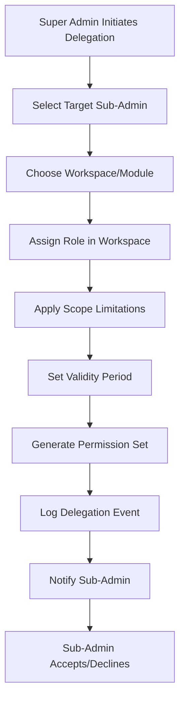
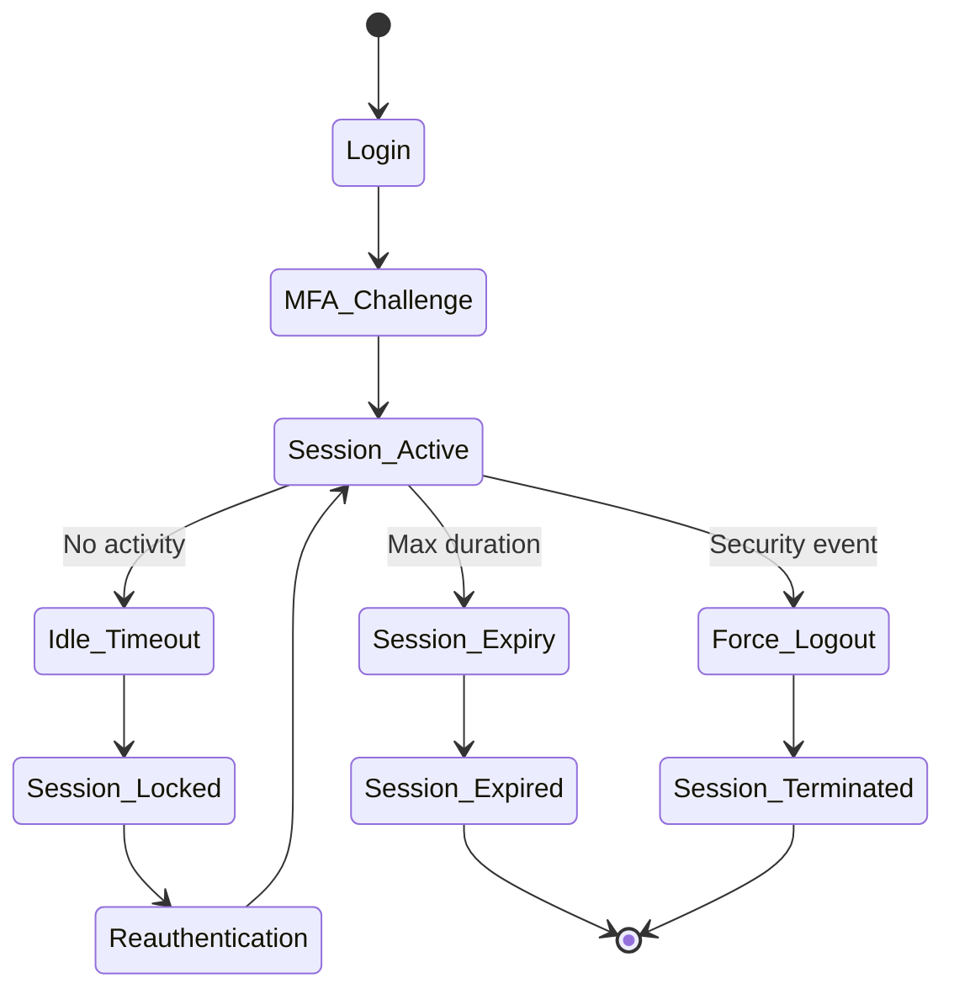

# Comprehensive RBAC Architecture for Multi-User Administrative Ecosystem

## Overview

This document outlines a complete Role-Based Access Control (RBAC) architecture designed for a multi-user administrative ecosystem. The system implements a hierarchical permission structure with a "Super Admin" tier that can delegate granular authority to various "Sub-Admin" roles while maintaining the principle of least privilege (PoLP).

## 1. Hierarchical Role Structure

### Role Hierarchy Definition

The RBAC system implements a clear hierarchical structure where permissions flow downward from the Super Admin level. Each role inherits permissions from roles above it in the hierarchy, with the ability to add role-specific permissions.

```
Super Admin (Root Access)
├── Operations Manager
│   ├── System Operations Lead
│   └── Infrastructure Admin
├── Financial Auditor
│   ├── Compliance Officer
│   └── Financial Analyst
├── Customer Support Lead
│   ├── Support Manager
│   ├── Ticket Supervisor
│   └── Support Agent
├── Content Moderator
│   ├── Senior Moderator
│   └── Junior Moderator
└── Security Administrator
    ├── Incident Response Lead
    └── Security Analyst
```

### Role Definitions and Responsibilities

#### **Super Admin (Root Access)**
- **Level**: 1 (Highest)
- **Scope**: Complete system access
- **Responsibilities**:
  - Create and manage all sub-admin roles
  - Delegate permissions and workspaces
  - Access all system resources and configurations
  - Override any permission restrictions
  - Emergency system controls
- **Access Level**: Unlimited

#### **Operations Manager**
- **Level**: 2
- **Reporting To**: Super Admin
- **Responsibilities**:
  - Oversee system operations and performance
  - Manage infrastructure and scalability
  - Coordinate with other department leads
  - Handle operational incidents
- **Inherits From**: Super Admin (selective permissions)

#### **Financial Auditor**
- **Level**: 2
- **Reporting To**: Super Admin
- **Responsibilities**:
  - Audit financial transactions and records
  - Ensure compliance with financial regulations
  - Generate financial reports
  - Monitor financial system integrity
- **Inherits From**: Super Admin (financial module only)

#### **Customer Support Lead**
- **Level**: 2
- **Reporting To**: Super Admin
- **Responsibilities**:
  - Oversee customer service operations
  - Manage support team performance
  - Handle escalated customer issues
  - Implement customer service policies
- **Inherits From**: Super Admin (customer module only)

#### **Content Moderator**
- **Level**: 2
- **Reporting To**: Super Admin
- **Responsibilities**:
  - Moderate user-generated content
  - Enforce content policies
  - Handle content-related violations
  - Review and approve content guidelines
- **Inherits From**: Super Admin (content module only)

#### **Security Administrator**
- **Level**: 2
- **Reporting To**: Super Admin
- **Responsibilities**:
  - Manage system security policies
  - Monitor security incidents
  - Conduct security assessments
  - Implement security controls
- **Inherits From**: Super Admin (security module only)

### Sub-Role Inheritance Rules

1. **Permission Inheritance**: Lower-level roles inherit all permissions from their parent roles
2. **Scope Limitation**: Child roles can have their permissions scoped to specific modules/workspaces
3. **Override Capability**: Super Admin can override any permission at any level
4. **Delegation Control**: Only Super Admin can create/modify roles and assign permissions

## 2. Granular Permission Matrix

### Permission Structure

Permissions are defined using a three-dimensional matrix:
- **Actions**: Create, Read, Update, Delete, Execute
- **Resources**: Specific system resources or modules
- **Scope**: Global, Module-specific, or Resource-specific

### Action Definitions

| Action | Code | Description |
|--------|------|-------------|
| Create | C | Ability to create new resources |
| Read | R | Ability to view/read resources |
| Update | U | Ability to modify existing resources |
| Delete | D | Ability to remove/delete resources |
| Execute | X | Ability to execute operations/commands |

### Resource Definitions

| Resource | Scope | Description |
|----------|-------|-------------|
| User Data | Module | User profiles, authentication, sessions |
| Financial Records | Module | Transactions, payments, financial reports |
| System Settings | Global | Configuration, policies, system parameters |
| Inventory | Module | Products, stock levels, suppliers |
| Content | Module | User-generated content, media, posts |
| Security Logs | Module | Audit logs, security events, incidents |
| Customer Support | Module | Tickets, communications, resolutions |
| Analytics | Module | Reports, metrics, dashboards |
| Infrastructure | Module | Servers, databases, network components |

### Permission Matrix by Role

#### **Super Admin Permissions**
```
All Resources: C, R, U, D, X (Full Access)
```

#### **Operations Manager Permissions**
```
System Settings: R, U
Infrastructure: C, R, U, D, X
Analytics: R
Security Logs: R
User Data: R (limited to operational metrics)
```

#### **Financial Auditor Permissions**
```
Financial Records: R (read-only audit access)
Analytics: R (financial reports only)
Security Logs: R (financial security events only)
System Settings: R (financial policy settings only)
```

#### **Customer Support Lead Permissions**
```
User Data: R, U (customer service fields only)
Customer Support: C, R, U, D, X
Content: R (customer communications)
Analytics: R (support metrics)
```

#### **Content Moderator Permissions**
```
Content: C, R, U, D, X
User Data: R (content-related user data)
Security Logs: R (content violations)
System Settings: R (content policies)
```

#### **Security Administrator Permissions**
```
Security Logs: C, R, U, D, X
User Data: R (security-related fields)
System Settings: R, U (security policies)
Infrastructure: R (security components)
All Resources: R (read-only security audit)
```

### Permission Granularity Examples

```typescript
// Example permission object
interface Permission {
  resource: string;
  actions: string[]; // ['C', 'R', 'U', 'D', 'X']
  scope: 'global' | 'module' | 'resource';
  conditions?: PermissionCondition[]; // Additional constraints
}

// Example conditions
interface PermissionCondition {
  field: string; // e.g., 'status', 'department', 'amount'
  operator: 'equals' | 'greater_than' | 'less_than' | 'in' | 'contains';
  value: any;
  description: string;
}

// Financial Auditor - Can only view transactions under $10,000
{
  resource: 'financial_records',
  actions: ['R'],
  scope: 'module',
  conditions: [{
    field: 'amount',
    operator: 'less_than',
    value: 10000,
    description: 'Limited to transactions under $10,000'
  }]
}
```

## 3. Delegation Logic

### Workspace-Based Delegation

The system implements "workspaces" as logical containers for delegating authority. Each workspace represents a specific module or functional area with its own set of resources and permissions.

#### Workspace Definitions

| Workspace | Included Resources | Primary Roles |
|-----------|-------------------|---------------|
| User Management | User Data, Authentication | Operations Manager |
| Financial Operations | Financial Records, Payments | Financial Auditor |
| Customer Service | Support Tickets, Communications | Customer Support Lead |
| Content Management | User Content, Media | Content Moderator |
| Security Operations | Security Logs, Policies | Security Administrator |
| System Administration | All Resources | Super Admin |

### Delegation Mechanism

#### **Workspace Assignment**
```typescript
interface WorkspaceAssignment {
  adminId: string;
  workspaceId: string;
  roleInWorkspace: string;
  permissions: Permission[];
  scopeLimitations: ScopeLimitation[];
  validityPeriod: {
    start: Date;
    end?: Date;
  };
  assignedBy: string;
  assignedAt: Date;
}
```

#### **Scope Limitations**
```typescript
interface ScopeLimitation {
  type: 'resource_filter' | 'time_restriction' | 'geographic_limit' | 'amount_threshold';
  parameter: string;
  value: any;
  description: string;
}

// Example: Customer Support Lead can only access tickets from their region
{
  type: 'geographic_limit',
  parameter: 'region',
  value: ['north_america', 'europe'],
  description: 'Limited to North America and Europe regions'
}
```

### Principle of Least Privilege Implementation

1. **Minimal Permissions**: Each role receives only the minimum permissions required
2. **Just-in-Time Access**: Temporary permission elevation for specific tasks
3. **Regular Audits**: Automated review of permission assignments
4. **Automatic Revocation**: Permissions expire automatically unless renewed

### Delegation Workflow



## 4. Audit & Accountability

### Comprehensive Audit Architecture

The audit system tracks every administrative action with full context and traceability.

#### Audit Event Structure
```typescript
interface AuditEvent {
  id: string;
  timestamp: Date;
  adminId: string;
  adminRole: string;
  action: string;
  resource: string;
  resourceId?: string;
  oldValues?: any;
  newValues?: any;
  ipAddress: string;
  userAgent: string;
  sessionId: string;
  workspaceId?: string;
  justification?: string;
  riskLevel: 'low' | 'medium' | 'high' | 'critical';
  status: 'success' | 'failure' | 'denied';
  errorMessage?: string;
  metadata: {
    delegationChain?: string[]; // Who delegated to whom
    approvalChain?: string[];   // Who approved this action
    automatedAction?: boolean;  // Was this automated?
    aiConfidence?: number;      // If AI-assisted
  };
}
```

### Audit Categories

#### **Administrative Actions**
- Role creation/modification/deletion
- Permission assignment/revocation
- Workspace delegation
- Policy changes

#### **Operational Actions**
- User data modifications
- Financial transactions
- Content moderation
- System configuration changes

#### **Security Events**
- Authentication attempts
- Permission checks
- Session management
- Security policy violations

### Audit Storage Strategy

#### **Immutable Audit Logs**
- **Blockchain Integration**: Optional blockchain storage for critical audit trails
- **Cryptographic Hashing**: Each log entry includes hash of previous entry
- **Tamper Detection**: Automatic integrity verification
- **Long-term Retention**: Configurable retention policies (7+ years for financial)

#### **Real-time Monitoring**
- **Anomaly Detection**: AI-powered detection of unusual administrative patterns
- **Alert Generation**: Automated alerts for suspicious activities
- **Compliance Reporting**: Automated generation of audit reports

### Accountability Measures

1. **Digital Signatures**: All administrative actions are digitally signed
2. **Four-Eyes Principle**: High-risk actions require secondary approval
3. **Delegation Transparency**: Full visibility into permission delegation chains
4. **Regular Reviews**: Automated and manual review of administrative activities

## 5. Security Protocols

### Multi-Factor Authentication (MFA)

#### **MFA Requirements by Role**
- **Super Admin**: Mandatory hardware token + biometric
- **Level 2 Roles**: Hardware token or TOTP app
- **Level 3+ Roles**: SMS or email verification

#### **MFA Implementation**
```typescript
interface MFASetup {
  userId: string;
  methods: MFAMethod[];
  gracePeriod: number; // minutes
  backupCodes: string[]; // encrypted
}

interface MFAMethod {
  type: 'totp' | 'sms' | 'email' | 'hardware' | 'biometric';
  identifier: string; // phone, email, device ID
  enabled: boolean;
  lastUsed: Date;
  failureCount: number;
}
```

### Session Management

#### **Session Security Features**
- **Session Timeout**: Automatic logout after inactivity
- **Concurrent Session Limits**: Maximum simultaneous sessions per user
- **Device Fingerprinting**: Track and validate device characteristics
- **Geographic Restrictions**: IP-based access controls
- **Time-based Access**: Restrict access to business hours

#### **Session Lifecycle**


### Advanced Security Controls

#### **Risk-Based Authentication**
- **Behavioral Analysis**: Detect unusual login patterns
- **Location Intelligence**: Flag logins from unusual locations
- **Device Recognition**: Identify known vs unknown devices

#### **Threat Detection**
- **Brute Force Protection**: Progressive delays and lockouts
- **Anomaly Detection**: Machine learning-based threat identification
- **Zero Trust Architecture**: Continuous verification of all actions

## 6. Database Schema Design

### Core Tables

#### **Users Table**
```sql
CREATE TABLE users (
    id VARCHAR(36) PRIMARY KEY,
    email VARCHAR(255) UNIQUE NOT NULL,
    username VARCHAR(100) UNIQUE,
    password_hash VARCHAR(255) NOT NULL,
    first_name VARCHAR(100),
    last_name VARCHAR(100),
    is_active BOOLEAN DEFAULT TRUE,
    created_at TIMESTAMP DEFAULT CURRENT_TIMESTAMP,
    updated_at TIMESTAMP DEFAULT CURRENT_TIMESTAMP,
    last_login TIMESTAMP,
    mfa_enabled BOOLEAN DEFAULT FALSE,
    account_locked BOOLEAN DEFAULT FALSE,
    lock_reason TEXT,
    INDEX idx_email (email),
    INDEX idx_username (username),
    INDEX idx_active (is_active)
);
```

#### **Roles Table**
```sql
CREATE TABLE roles (
    id VARCHAR(36) PRIMARY KEY,
    name VARCHAR(100) UNIQUE NOT NULL,
    display_name VARCHAR(150),
    description TEXT,
    level INT NOT NULL, -- 1=Super Admin, 2=Department Lead, 3=Specialist
    is_system_role BOOLEAN DEFAULT FALSE,
    parent_role_id VARCHAR(36),
    created_at TIMESTAMP DEFAULT CURRENT_TIMESTAMP,
    updated_at TIMESTAMP DEFAULT CURRENT_TIMESTAMP,
    created_by VARCHAR(36),
    FOREIGN KEY (parent_role_id) REFERENCES roles(id),
    FOREIGN KEY (created_by) REFERENCES users(id),
    INDEX idx_level (level),
    INDEX idx_parent (parent_role_id)
);
```

#### **Permissions Table**
```sql
CREATE TABLE permissions (
    id VARCHAR(36) PRIMARY KEY,
    name VARCHAR(150) UNIQUE NOT NULL,
    display_name VARCHAR(200),
    description TEXT,
    resource VARCHAR(100) NOT NULL,
    actions JSON NOT NULL, -- ['C', 'R', 'U', 'D', 'X']
    scope VARCHAR(50) DEFAULT 'module', -- global, module, resource
    conditions JSON, -- Additional constraints
    is_system_permission BOOLEAN DEFAULT FALSE,
    created_at TIMESTAMP DEFAULT CURRENT_TIMESTAMP,
    updated_at TIMESTAMP DEFAULT CURRENT_TIMESTAMP,
    INDEX idx_resource (resource),
    INDEX idx_scope (scope)
);
```

#### **Role_Permissions Mapping Table**
```sql
CREATE TABLE role_permissions (
    id VARCHAR(36) PRIMARY KEY,
    role_id VARCHAR(36) NOT NULL,
    permission_id VARCHAR(36) NOT NULL,
    assigned_by VARCHAR(36) NOT NULL,
    assigned_at TIMESTAMP DEFAULT CURRENT_TIMESTAMP,
    expires_at TIMESTAMP,
    is_active BOOLEAN DEFAULT TRUE,
    delegation_notes TEXT,
    FOREIGN KEY (role_id) REFERENCES roles(id) ON DELETE CASCADE,
    FOREIGN KEY (permission_id) REFERENCES permissions(id) ON DELETE CASCADE,
    FOREIGN KEY (assigned_by) REFERENCES users(id),
    UNIQUE KEY unique_role_permission (role_id, permission_id),
    INDEX idx_role (role_id),
    INDEX idx_permission (permission_id),
    INDEX idx_active (is_active),
    INDEX idx_expires (expires_at)
);
```

#### **User_Roles Mapping Table**
```sql
CREATE TABLE user_roles (
    id VARCHAR(36) PRIMARY KEY,
    user_id VARCHAR(36) NOT NULL,
    role_id VARCHAR(36) NOT NULL,
    assigned_by VARCHAR(36) NOT NULL,
    assigned_at TIMESTAMP DEFAULT CURRENT_TIMESTAMP,
    expires_at TIMESTAMP,
    is_active BOOLEAN DEFAULT TRUE,
    workspace_id VARCHAR(36),
    scope_limitations JSON,
    FOREIGN KEY (user_id) REFERENCES users(id) ON DELETE CASCADE,
    FOREIGN KEY (role_id) REFERENCES roles(id) ON DELETE CASCADE,
    FOREIGN KEY (assigned_by) REFERENCES users(id),
    FOREIGN KEY (workspace_id) REFERENCES workspaces(id),
    UNIQUE KEY unique_user_role_workspace (user_id, role_id, workspace_id),
    INDEX idx_user (user_id),
    INDEX idx_role (role_id),
    INDEX idx_workspace (workspace_id),
    INDEX idx_active (is_active),
    INDEX idx_expires (expires_at)
);
```

#### **Workspaces Table**
```sql
CREATE TABLE workspaces (
    id VARCHAR(36) PRIMARY KEY,
    name VARCHAR(100) UNIQUE NOT NULL,
    display_name VARCHAR(150),
    description TEXT,
    module VARCHAR(100) NOT NULL,
    resources JSON NOT NULL, -- Associated resources
    is_active BOOLEAN DEFAULT TRUE,
    created_by VARCHAR(36),
    created_at TIMESTAMP DEFAULT CURRENT_TIMESTAMP,
    updated_at TIMESTAMP DEFAULT CURRENT_TIMESTAMP,
    FOREIGN KEY (created_by) REFERENCES users(id),
    INDEX idx_module (module),
    INDEX idx_active (is_active)
);
```

#### **Audit_Log Table**
```sql
CREATE TABLE audit_log (
    id VARCHAR(36) PRIMARY KEY,
    timestamp TIMESTAMP DEFAULT CURRENT_TIMESTAMP,
    admin_id VARCHAR(36) NOT NULL,
    admin_role VARCHAR(100),
    action VARCHAR(100) NOT NULL,
    resource VARCHAR(100) NOT NULL,
    resource_id VARCHAR(36),
    old_values JSON,
    new_values JSON,
    ip_address VARCHAR(45),
    user_agent TEXT,
    session_id VARCHAR(36),
    workspace_id VARCHAR(36),
    justification TEXT,
    risk_level ENUM('low', 'medium', 'high', 'critical'),
    status ENUM('success', 'failure', 'denied'),
    error_message TEXT,
    metadata JSON,
    hash VARCHAR(128), -- Cryptographic hash for immutability
    FOREIGN KEY (admin_id) REFERENCES users(id),
    FOREIGN KEY (workspace_id) REFERENCES workspaces(id),
    INDEX idx_admin (admin_id),
    INDEX idx_action (action),
    INDEX idx_resource (resource),
    INDEX idx_timestamp (timestamp),
    INDEX idx_risk_level (risk_level),
    INDEX idx_session (session_id)
);
```

### Additional Supporting Tables

#### **Sessions Table**
```sql
CREATE TABLE sessions (
    id VARCHAR(36) PRIMARY KEY,
    user_id VARCHAR(36) NOT NULL,
    token_hash VARCHAR(128) NOT NULL,
    ip_address VARCHAR(45),
    user_agent TEXT,
    device_fingerprint VARCHAR(255),
    location JSON,
    started_at TIMESTAMP DEFAULT CURRENT_TIMESTAMP,
    last_activity TIMESTAMP DEFAULT CURRENT_TIMESTAMP,
    expires_at TIMESTAMP,
    is_active BOOLEAN DEFAULT TRUE,
    mfa_verified BOOLEAN DEFAULT FALSE,
    risk_score INT DEFAULT 0,
    FOREIGN KEY (user_id) REFERENCES users(id) ON DELETE CASCADE,
    INDEX idx_user (user_id),
    INDEX idx_token (token_hash),
    INDEX idx_active (is_active),
    INDEX idx_expires (expires_at)
);
```

#### **MFA_Configurations Table**
```sql
CREATE TABLE mfa_configurations (
    id VARCHAR(36) PRIMARY KEY,
    user_id VARCHAR(36) UNIQUE NOT NULL,
    methods JSON NOT NULL,
    grace_period INT DEFAULT 0,
    backup_codes JSON, -- Encrypted
    last_verified TIMESTAMP,
    created_at TIMESTAMP DEFAULT CURRENT_TIMESTAMP,
    updated_at TIMESTAMP DEFAULT CURRENT_TIMESTAMP,
    FOREIGN KEY (user_id) REFERENCES users(id) ON DELETE CASCADE
);
```

### Database Optimization

#### **Indexing Strategy**
- **Composite Indexes**: For frequently queried combinations (user_id + role_id, role_id + permission_id)
- **Partial Indexes**: For active records and time-based queries
- **Foreign Key Indexes**: Automatic indexing on foreign key columns
- **Full-text Indexes**: For audit log search capabilities

#### **Partitioning Strategy**
- **Audit Logs**: Partitioned by month for performance and retention management
- **Sessions**: Partitioned by status and time for efficient cleanup
- **Time-series Data**: Partitioned by time periods for analytics

#### **Security Measures**
- **Row-Level Security**: Implement PostgreSQL RLS for multi-tenant data access
- **Encryption**: Encrypt sensitive data at rest and in transit
- **Audit Triggers**: Automatic audit logging via database triggers

This comprehensive RBAC architecture provides a scalable, secure, and auditable foundation for multi-user administrative operations while maintaining the principle of least privilege and ensuring full accountability.