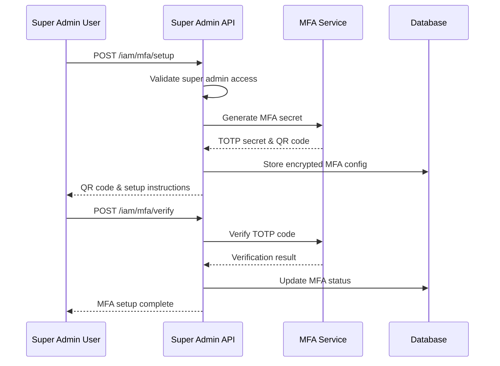
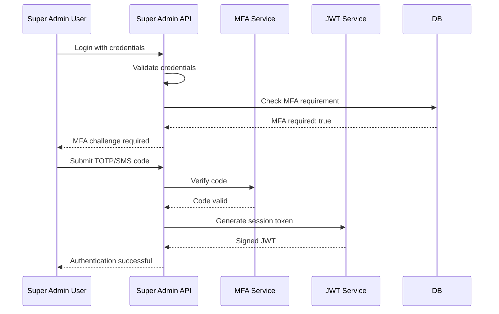
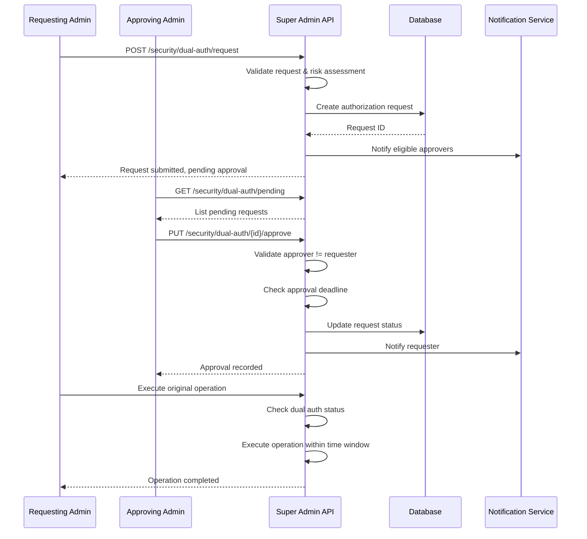
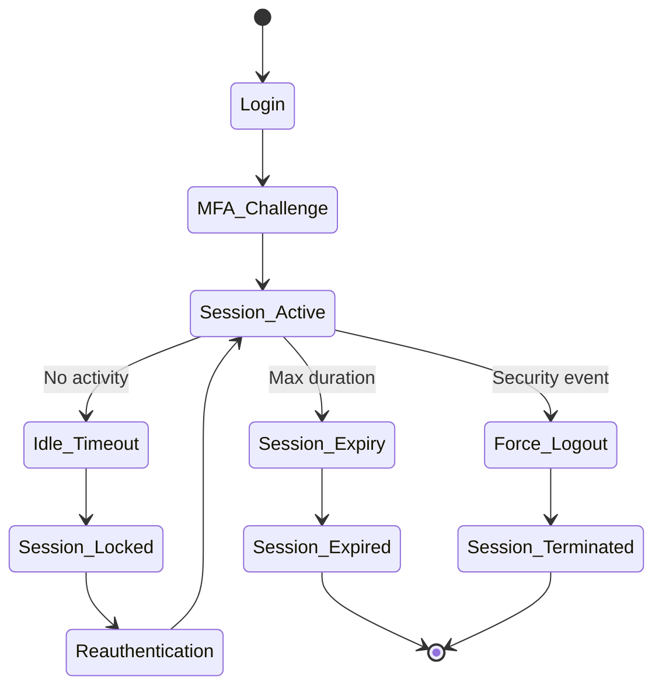
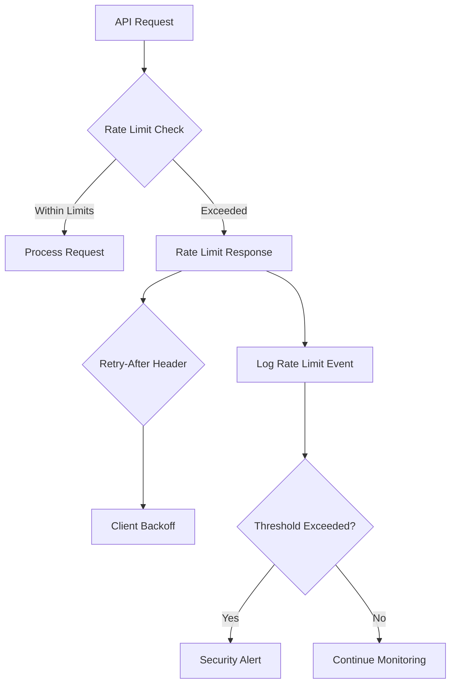
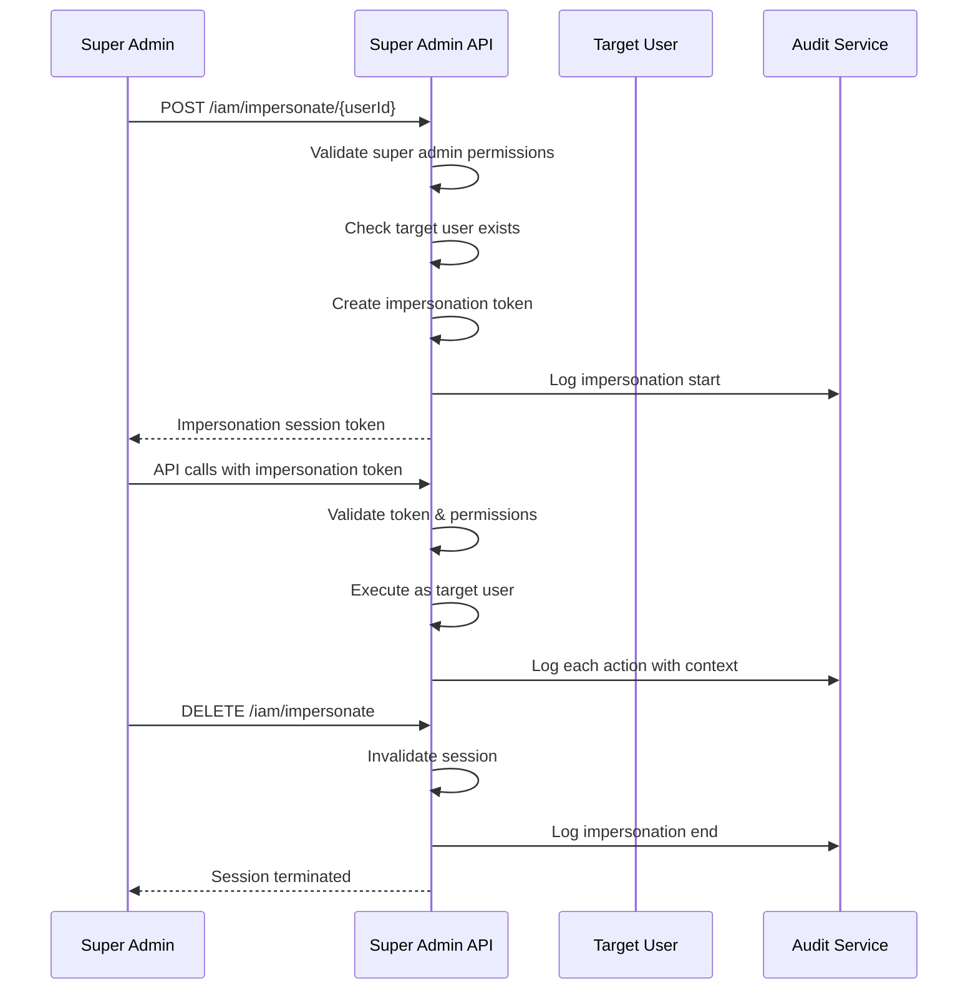
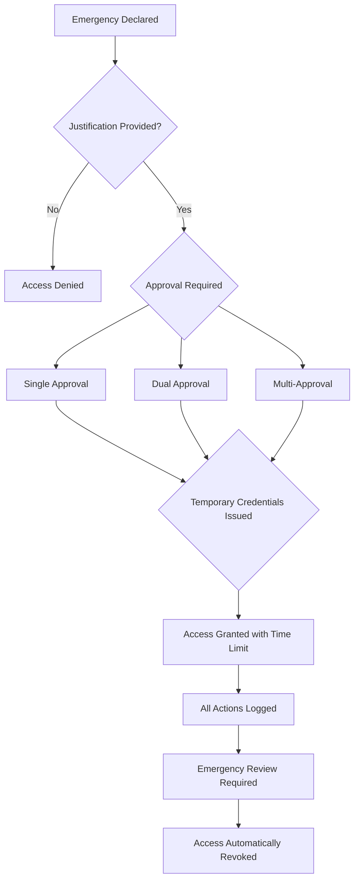
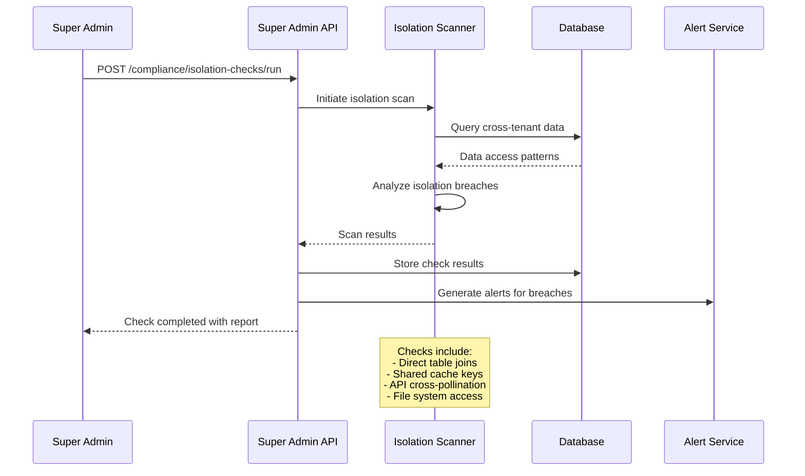
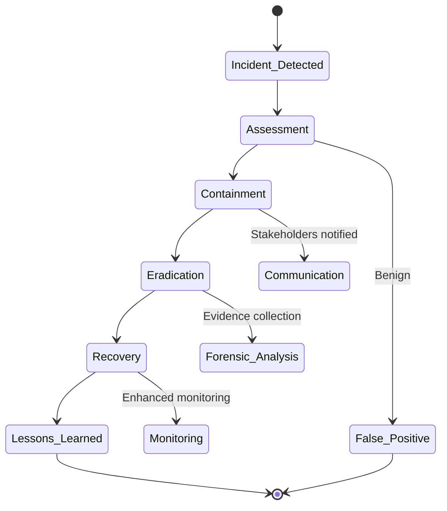
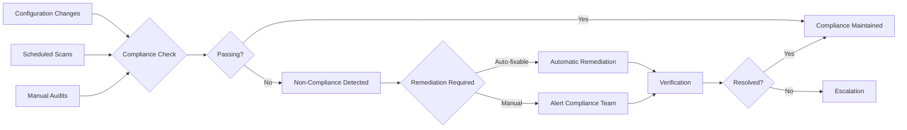

# Super Admin Security Workflows

## 1. Multi-Factor Authentication (MFA) Enforcement

### MFA Registration Workflow


### MFA Authentication Flow


## 2. Four-Eyes Principle (Dual Authorization)

### High-Risk Operation Workflow


### Dual Authorization Rules
- **Requester ≠ Approver**: Different super admin users required
- **Time Window**: Approval valid for 24 hours (configurable)
- **Risk Levels**:
  - Low: Single approval required
  - Medium: Different role level required
  - High: Level 1 admin approval required
  - Critical: Multiple approvals required

## 3. Session Management & Security

### Secure Session Lifecycle


### Session Security Controls
- **Session Timeout**: 1 hour idle, 8 hours maximum
- **Concurrent Sessions**: Maximum 3 per user
- **IP Binding**: Optional IP address validation
- **Device Fingerprinting**: Track device characteristics
- **Geographic Restrictions**: Country/region blocking

## 4. Rate Limiting & Abuse Prevention

### Multi-Layer Rate Limiting
```typescript
interface RateLimitConfig {
  global: { requests: 1000, window: 60 };     // per minute
  perEndpoint: { requests: 100, window: 60 };  // per endpoint
  perUser: { requests: 500, window: 3600 };    // per user per hour
  perIP: { requests: 200, window: 60 };        // per IP per minute
  burstAllowance: 1.2;                         // burst multiplier
}
```

### Rate Limit Response Flow


## 5. Impersonation Security Protocol

### Impersonation Session Workflow


### Impersonation Security Controls
- **Permission Validation**: Can only impersonate users in accessible tenants
- **Session Logging**: All actions logged with impersonation context
- **Time Limits**: Maximum 2 hours per session
- **Risk Scoring**: High-risk impersonations require additional approval
- **Audit Trail**: Complete chain of custody

## 6. Emergency Access Procedures

### Emergency Access Workflow


### Emergency Access Rules
- **Declaration**: Requires documented justification
- **Approval Matrix**: Based on emergency severity
- **Time Limits**: Maximum 24 hours, renewable with approval
- **Monitoring**: Real-time activity monitoring during emergency
- **Post-Incident Review**: Mandatory security review within 72 hours

## 7. Data Isolation Verification

### Isolation Check Workflow


## 8. Incident Response Procedures

### Security Incident Workflow


### Incident Response Teams
- **First Response**: Automated systems and on-call engineer
- **Security Team**: Specialized security engineers
- **Management**: Executive notification for high-severity
- **Legal/Compliance**: Regulatory reporting requirements
- **External**: Forensic experts for major breaches

## 9. Compliance Monitoring

### Continuous Compliance Workflow


This comprehensive security workflow framework ensures the Super Admin Module maintains the highest standards of security, compliance, and operational integrity for enterprise multi-tenant environments.