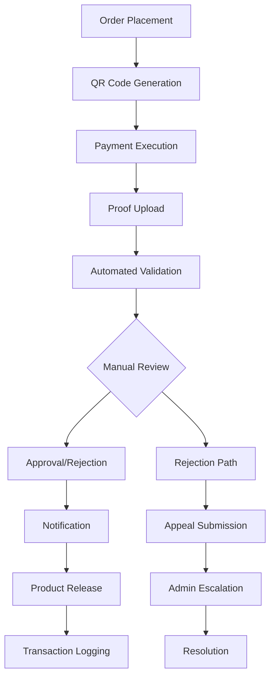

# Manual Bank Transfer Proof System Design

## Overview
This document outlines a comprehensive, secure, and scalable system for handling manual bank transfer proofs in a multi-level marketing (MLM) or distribution network. The system enables secure upload and verification of payment proofs without integrated payment gateways, incorporating fraud prevention, data privacy compliance, and excellent user experience.

## 1. User Roles and Permissions

### Hierarchical Roles
- **Buyer/Downline**: Can upload payment proofs, view order status, and submit appeals
- **Upline/Stockist**: Can upload QR codes, review and approve/reject proofs, manage downlines, and view transaction history
- **Admin**: Oversees system operations, handles escalations, generates reports, and manages user roles
- **Auditor** (Optional): Read-only access for compliance checks and audit reviews

### Access Controls
- **Role-Based Authentication**: JWT tokens with embedded role claims
- **Multi-Factor Authentication (MFA)**: Required for upline/stockist and admin roles
- **Permission Levels**:
  - Buyers: Upload proofs, view own orders
  - Uplines: Upload QR codes, approve proofs for their downlines, view network analytics
  - Admins: Full system access, user management, bulk operations
  - Auditors: Read-only access to all data except sensitive payment details

### Security Implementation
- OAuth 2.0 / OpenID Connect for authentication
- Session management with automatic logout after inactivity
- IP-based restrictions for admin access
- Audit logging for all permission changes

## 2. Step-by-Step Workflow



### Detailed Process
1. **Order Placement**: Buyer/downline places order through existing system
2. **QR Code Generation**: Upline/stockist generates and shares payment QR code
3. **Payment Execution**: Buyer completes bank transfer using provided QR code
4. **Proof Upload**: Buyer uploads transfer slip/screenshot/receipt
5. **Automated Validation**: System checks file type, size, and basic integrity
6. **Manual Review**: Upline reviews proof against order details
7. **Approval/Rejection**: Upline approves or rejects with comments
8. **Notification**: Real-time alerts to buyer and relevant parties
9. **Product Release**: Inventory deduction and order fulfillment
10. **Transaction Logging**: Complete audit trail recorded

### Conditional Paths
- **Rejection**: Buyer can appeal within 24 hours
- **Appeal**: Escalates to admin for final decision
- **Timeout**: Automatic escalation if no review within 48 hours
- **Dispute**: Chat support or ticketing system for resolution

## 3. Security Measures

### File Security
- **End-to-End Encryption**: AES-256 encryption for file storage and transmission
- **Secure Storage**: Cloud-based storage (AWS S3/Azure Blob) with access controls
- **File Integrity**: SHA-256 hashing for tamper detection

### Fraud Prevention
- **Duplicate Detection**: Image hashing (Perceptual Hashing) to identify duplicate proofs
- **OCR Processing**: Extract payment details from images for validation
- **Cross-Reference**: Integration with bank APIs for transaction verification (where available)
- **Rate Limiting**: Maximum 5 uploads per hour per user
- **IP Tracking**: Monitor for suspicious upload patterns

### Audit and Compliance
- **Blockchain Integration**: Optional immutable transaction records using blockchain
- **Third-Party Verification**: Integration with services like Jumio for document verification
- **GDPR Compliance**: Data minimization, consent management, right to erasure
- **Audit Trails**: All actions logged with timestamps, IP addresses, and user IDs

### Risk Mitigation
- **Insider Threats**: Segregation of duties, approval workflows
- **Spoofed Proofs**: Multi-layer validation including manual review
- **Data Privacy**: Encrypted storage, access logging, regular security audits

## 4. User Interface Components

### Upload Interface
- **Drag-and-Drop Upload**: Intuitive file upload with preview
- **File Validation**: Real-time feedback on file type/size
- **Mobile Optimization**: Responsive design for mobile devices
- **Accessibility**: Screen reader support, keyboard navigation

### Approval Dashboard
- **Filtering and Search**: Filter by status, date, amount, downline
- **Bulk Actions**: Approve/reject multiple proofs simultaneously
- **Real-Time Updates**: WebSocket connections for live notifications
- **Status Indicators**: Color-coded status badges

### Notification System
- **In-App Alerts**: Toast notifications for status changes
- **Email/SMS Integration**: Configurable notification preferences
- **Push Notifications**: Mobile app notifications for critical updates

### Admin Panel
- **Monitoring Dashboard**: System health, approval rates, fraud alerts
- **Reporting Tools**: Exportable reports on transactions and user activity
- **User Management**: Role assignment, account suspension
- **Audit Logs**: Searchable log viewer with filtering

## 5. Database Schema

### Relational Schema (PostgreSQL Recommended)

```sql
-- Users table with role hierarchy
CREATE TABLE users (
    id UUID PRIMARY KEY,
    email VARCHAR(255) UNIQUE NOT NULL,
    role ENUM('buyer', 'upline', 'admin', 'auditor') NOT NULL,
    upline_id UUID REFERENCES users(id),
    mfa_enabled BOOLEAN DEFAULT FALSE,
    created_at TIMESTAMP DEFAULT NOW(),
    updated_at TIMESTAMP DEFAULT NOW()
);

-- Orders table
CREATE TABLE orders (
    id UUID PRIMARY KEY,
    buyer_id UUID REFERENCES users(id),
    upline_id UUID REFERENCES users(id),
    amount DECIMAL(10,2) NOT NULL,
    status ENUM('pending', 'paid', 'fulfilled', 'cancelled') DEFAULT 'pending',
    created_at TIMESTAMP DEFAULT NOW(),
    updated_at TIMESTAMP DEFAULT NOW()
);

-- Payment proofs table
CREATE TABLE payment_proofs (
    id UUID PRIMARY KEY,
    order_id UUID REFERENCES orders(id),
    file_path VARCHAR(500) NOT NULL,
    file_hash VARCHAR(64) NOT NULL,
    ocr_data JSONB,
    status ENUM('uploaded', 'approved', 'rejected', 'escalated') DEFAULT 'uploaded',
    uploaded_by UUID REFERENCES users(id),
    reviewed_by UUID REFERENCES users(id),
    reviewed_at TIMESTAMP,
    rejection_reason TEXT,
    created_at TIMESTAMP DEFAULT NOW(),
    updated_at TIMESTAMP DEFAULT NOW()
);

-- Transactions table
CREATE TABLE transactions (
    id UUID PRIMARY KEY,
    proof_id UUID REFERENCES payment_proofs(id),
    amount DECIMAL(10,2) NOT NULL,
    bank_reference VARCHAR(100),
    approval_log JSONB,
    ip_address INET,
    created_at TIMESTAMP DEFAULT NOW()
);

-- Inventory table
CREATE TABLE inventory (
    id UUID PRIMARY KEY,
    product_id UUID NOT NULL,
    stockist_id UUID REFERENCES users(id),
    quantity INTEGER NOT NULL,
    reserved_quantity INTEGER DEFAULT 0,
    updated_at TIMESTAMP DEFAULT NOW()
);

-- Audit logs table
CREATE TABLE audit_logs (
    id UUID PRIMARY KEY,
    user_id UUID REFERENCES users(id),
    action VARCHAR(100) NOT NULL,
    entity_type VARCHAR(50),
    entity_id UUID,
    old_values JSONB,
    new_values JSONB,
    ip_address INET,
    created_at TIMESTAMP DEFAULT NOW()
);
```

### Indexing Strategy
- Composite indexes on (upline_id, status) for efficient downline queries
- Full-text search on audit logs
- Time-based partitioning for large tables (transactions, audit_logs)

## 6. Error Handling and Dispute Resolution

### Error Types and Handling
- **Invalid Files**: Automatic rejection with user-friendly messages
- **Upload Failures**: Retry mechanism with exponential backoff
- **System Timeouts**: Graceful degradation with offline queuing
- **Corrupted Files**: Integrity checks with automatic cleanup

### Dispute Resolution Process
1. **Initial Appeal**: Buyer submits appeal with additional evidence
2. **Upline Review**: Upline re-evaluates with new information
3. **Admin Escalation**: Automatic escalation for unresolved disputes
4. **Resolution Portal**: Dedicated interface for dispute management
5. **Chat Support**: Real-time assistance for complex cases

### Automated Processes
- **Retry Logic**: Up to 3 attempts for failed operations
- **Fallback Mechanisms**: Alternative storage options during outages
- **Alert System**: Automatic notifications for system errors

## 7. Integration Points

### API Endpoints
- **RESTful APIs**: Standard CRUD operations for orders, proofs, users
- **Webhook Support**: Real-time notifications for status changes
- **GraphQL API**: Flexible queries for complex data relationships

### System Integrations
- **Inventory Management**: API calls to deduct stock upon approval
- **Order Management**: Sync order status with existing systems
- **ERP Systems**: Integration with SAP or custom ERPs via adapters
- **Notification Services**: Email/SMS gateways for alerts

### Data Exchange
- **Event-Driven Architecture**: Message queues for decoupled communication
- **API Gateway**: Centralized access control and rate limiting
- **Service Mesh**: Istio or similar for microservices communication

## 8. Scalability Considerations

### Architecture
- **Microservices**: Separate services for uploads, validation, approvals
- **Load Balancing**: Distribute traffic across multiple instances
- **Horizontal Scaling**: Auto-scaling based on user load

### Data Management
- **Database Sharding**: Shard by region or upline hierarchy
- **Caching Layer**: Redis for frequently accessed data
- **CDN Integration**: For static file serving

### Performance Optimizations
- **Asynchronous Processing**: Queue-based processing for uploads/verifications
- **Background Jobs**: Worker processes for OCR and fraud detection
- **Database Optimization**: Read replicas for reporting queries

### Monitoring and Scaling
- **Metrics Collection**: Prometheus for system metrics
- **Auto-Scaling**: Kubernetes HPA based on CPU/memory usage
- **Performance Monitoring**: APM tools like New Relic or DataDog

## 9. Additional Features

### Compliance
- **KYC Integration**: Identity verification for new users
- **Regulatory Reporting**: Automated compliance reports
- **Data Retention**: Configurable data lifecycle management

### Reporting and Analytics
- **Transaction Dashboards**: Real-time metrics on approval rates
- **Network Analytics**: Performance insights for upline hierarchies
- **Fraud Analytics**: Machine learning models for anomaly detection

### Internationalization
- **Multi-Language Support**: i18n framework for UI localization
- **Currency Handling**: Multi-currency support with exchange rates
- **Regional Compliance**: Adaptable to different regulatory requirements

### Offline Capabilities
- **Progressive Web App**: Service workers for offline functionality
- **Local Storage**: Cache critical data for offline access
- **Sync Mechanism**: Automatic synchronization when connectivity returns

## 10. Implementation Pseudocode

### Proof Upload Process
```javascript
async function uploadPaymentProof(orderId, file, userId) {
    // Validate user permissions
    if (!await checkUserPermission(userId, 'upload_proof', orderId)) {
        throw new Error('Unauthorized');
    }

    // Rate limiting check
    if (!await checkRateLimit(userId, 'upload', 5)) {
        throw new Error('Rate limit exceeded');
    }

    // File validation
    const validation = await validateFile(file);
    if (!validation.valid) {
        throw new Error(validation.error);
    }

    // Encrypt and store file
    const encryptedFile = await encryptFile(file);
    const filePath = await storeFile(encryptedFile);

    // Create proof record
    const proof = await createPaymentProof({
        orderId,
        filePath,
        fileHash: await generateHash(file),
        uploadedBy: userId
    });

    // Queue for automated validation
    await queueValidation(proof.id);

    return proof;
}
```

### Approval Process
```javascript
async function approvePaymentProof(proofId, reviewerId, comments) {
    // Validate reviewer permissions
    const proof = await getPaymentProof(proofId);
    if (!await checkUplinePermission(reviewerId, proof.orderId)) {
        throw new Error('Unauthorized');
    }

    // Update proof status
    await updateProofStatus(proofId, 'approved', reviewerId, comments);

    // Log audit trail
    await logAuditEvent({
        userId: reviewerId,
        action: 'approve_proof',
        entityType: 'payment_proof',
        entityId: proofId
    });

    // Trigger notifications
    await notifyBuyer(proof.orderId, 'approved');
    await notifyAdmins('proof_approved', proofId);

    // Release inventory
    await releaseInventory(proof.orderId);

    // Queue transaction logging
    await queueTransactionLogging(proofId);
}
```

This design provides a robust, secure, and scalable solution for manual payment proof handling in MLM networks, addressing all specified requirements while maintaining high standards for security, compliance, and user experience.